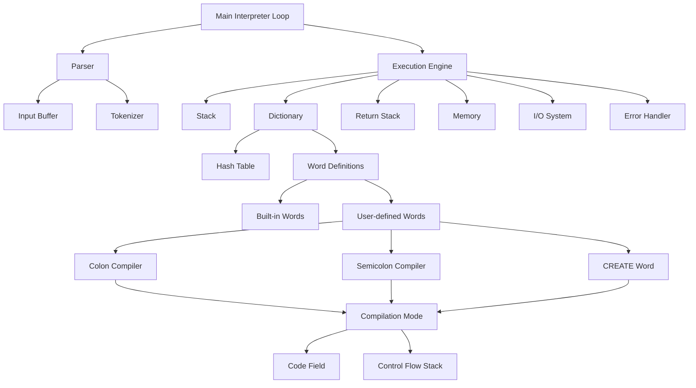

# Forth Interpreter Implementation Plan

## Project Overview
This document outlines the implementation plan for a Forth-like stack-based interpreter in standard C, based on the requirements specified in the brief.

## Requirements Analysis
The interpreter will support:
1. Basic arithmetic operations (+, -, *, /, mod)
2. Stack manipulation operations (dup, drop, swap, over, rot, nip, tuck)
3. Comparison operations (=, <, >, <=, >=, <>)
4. Logical operations (and, or, not)
5. I/O operations (., .s, cr)
6. User-defined words (functions) with : and ;
7. Simple memory operations (!, @)
8. Control flow constructs (if-then-else, begin-until, begin-while-repeat)
9. CREATE word for defining expandable words
10. Stack for data manipulation and dictionary of built-in and user-defined words

## Architecture Design
The interpreter will consist of:
1. Main interpreter loop that reads and executes Forth commands
2. Stack data structure for data manipulation
3. Dictionary data structure for storing built-in and user-defined words
4. Parser for interpreting Forth syntax
5. Execution engine that processes commands
6. Memory management system for variables and data storage
7. I/O system for input and output operations
8. Error handling system

## Data Structures

### Stack
- Fixed-size array for storing integer values
- Stack pointer to track the top of the stack
- Operations: push, pop, peek, check for overflow/underflow

### Dictionary
- Linked list or array of word definitions
- Each entry contains: name, function pointer (for built-ins), code field (for user-defined words)
- Hash table for quick word lookup

### Memory
- Array for storing variables and data
- Addressing system for memory access

### Input Buffer
- Buffer for storing the current input line
- Tokenizer for breaking input into words

### Return Stack
- Separate stack for return addresses during function calls

### State Variables
- Interpreter state (interpreting vs compiling)
- Base for number conversion (decimal, hex, etc.)

## Implementation Plan

### Phase 1: Core Infrastructure (Week 1)
- Implement basic stack operations
- Create dictionary structure
- Develop main interpreter loop
- Implement basic I/O operations

### Phase 2: Basic Operations (Week 2)
- Implement arithmetic operations
- Add stack manipulation words
- Implement comparison and logical operations
- Add error handling

### Phase 3: User-Defined Words (Week 3)
- Implement colon and semicolon compilers
- Develop word definition storage
- Create word lookup functionality
- Test basic word definitions

### Phase 4: Control Flow (Week 4)
- Implement if-then-else constructs
- Add loop constructs (begin-until, begin-while-repeat)
- Develop control flow stack
- Test complex control flow scenarios

### Phase 5: Advanced Features (Week 5)
- Implement CREATE word
- Add memory operations
- Optimize performance
- Comprehensive testing

### Phase 6: Documentation and Refinement (Week 6)
- Write documentation
- Perform final testing
- Bug fixes and optimizations
- Code review and cleanup

## Built-in Operations Implementation

### Arithmetic Operations
- Implement functions that pop operands from stack, perform operation, and push result
- Handle division by zero error
- Handle overflow conditions

### Stack Manipulation Operations
- Implement each operation according to Forth standard
- Handle stack underflow conditions

### Comparison Operations
- Implement functions that compare top two stack elements
- Push boolean result (0 or -1) back on stack

### Logical Operations
- Implement bitwise operations
- Handle boolean values correctly

### I/O Operations
- Implement number output (.)
- Implement stack display (.s)
- Implement carriage return (cr)

### Memory Operations
- Implement store (!) and fetch (@) operations
- Handle memory addressing

## User-Defined Word Functionality

### Colon Compiler (:)
- Switch interpreter to compile mode
- Create new dictionary entry for the word being defined
- Store the name of the new word

### Semicolon Compiler (;)
- End compilation mode
- Finalize the current word definition
- Add the word to the dictionary

### Word Definition Storage
- Store sequence of tokens that make up the word's definition
- Handle nested word definitions
- Manage compilation of literals and references

### CREATE Word
- Create a new dictionary entry without immediate compilation
- Allow for expanding words

### Word Lookup
- Search dictionary for user-defined words
- Distinguish between immediate and non-immediate words

## Control Flow Implementation

### If-Then-Else Construct
- Implement conditional execution
- Handle forward references in compilation
- Manage branching instructions

### Begin-Until Loop
- Implement post-test loop structure
- Handle backward jumps in compilation

### Begin-While-Repeat Loop
- Implement pre-test loop structure
- Manage multiple exit points
- Handle nested loops

### Control Flow Stack
- Implement stack for managing control flow references
- Track origins of forward references
- Resolve addresses during compilation

### Branch Instructions
- Implement unconditional and conditional branches
- Handle relative addressing

## Architecture Diagram

